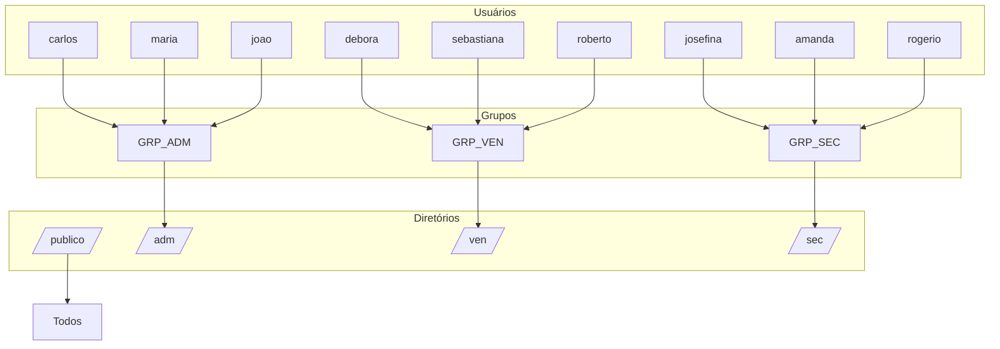

# Gerenciamento de Usuários e Diretórios no Linux

Este projeto consiste em um script shell que automatiza a criação de diretórios, grupos de usuários e usuários no Linux Ubuntu Server. Além disso, define permissões de acesso para cada diretório, com base nos grupos associados.

## Estrutura do Script
O script realiza as seguintes ações:

1. **Criação de Diretórios**:
   - `/publico`: Diretório de uso geral.
   - `/adm`: Diretório para o grupo administrativo.
   - `/ven`: Diretório para o grupo de vendas.
   - `/sec`: Diretório para o grupo de segurança.

2. **Criação de Grupos**:
   - `GRP_ADM`: Grupo para os usuários administrativos.
   - `GRP_VEN`: Grupo para os usuários de vendas.
   - `GRP_SEC`: Grupo para os usuários de segurança.

3. **Criação de Usuários**:
   - Usuários são criados e associados aos seus respectivos grupos.
   - As senhas são definidas usando o algoritmo de hashing SHA-512.

4. **Configuração de Grupos para os Usuários**:
   - Cada usuário é atribuído ao grupo correspondente.

5. **Definição de Permissões nos Diretórios**:
   - `/publico`: Permissões completas para todos os usuários (777).
   - `/adm`, `/ven`, `/sec`: Acesso restrito aos membros dos grupos correspondentes (770).

## Execução do Script
1. Certifique-se de que o script possui permissões de execução:
   ```bash
   chmod +x iac1.sh
   ```

2. Execute o script como superusuário:
   ```bash
   sudo ./iac1.sh
   ```

## Estrutura Criada


## Observações
- O script define senhas padronizadas para todos os usuários (123). Por questões de segurança, é recomendado alterá-las após a execução.
- Este script deve ser executado em um ambiente controlado, preferencialmente em uma máquina de teste ou servidor recém-configurado.
- Certifique-se de que os diretórios, usuários e grupos não existam antes de executar o script para evitar erros.

## Licença
Este projeto está sob a licença MIT. Veja o arquivo `LICENSE` para mais detalhes.

